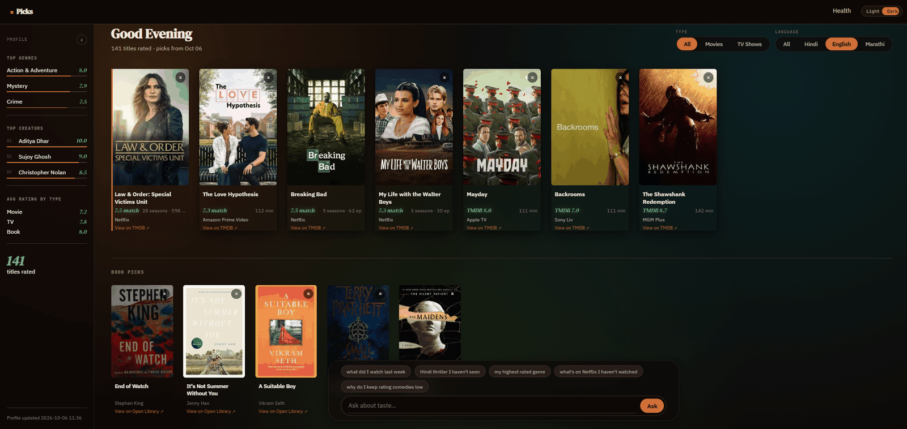
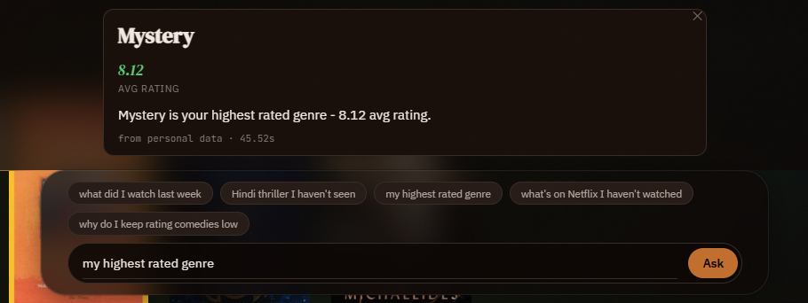
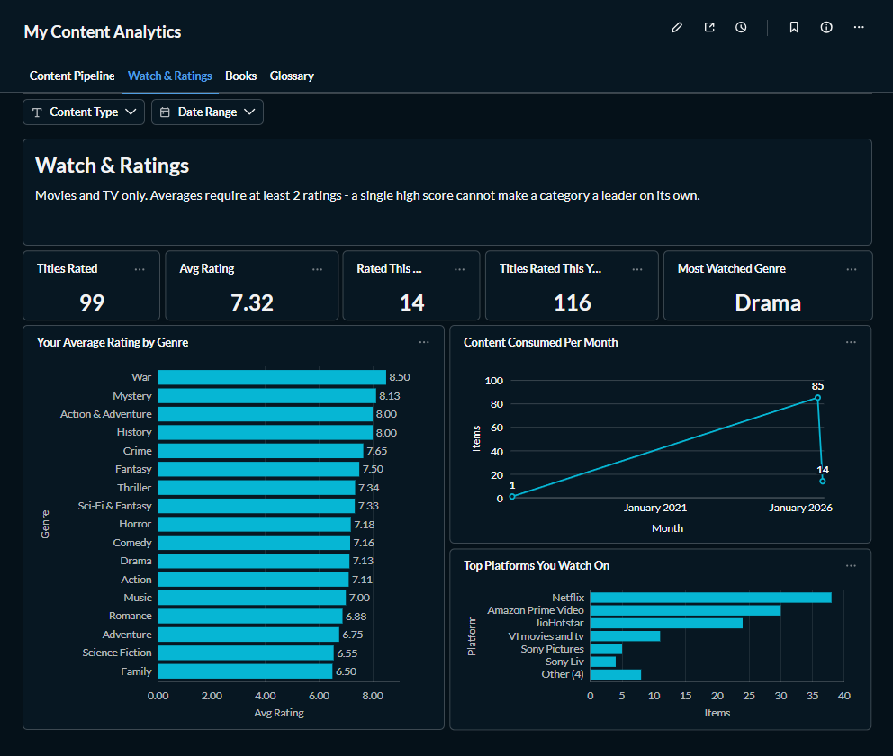
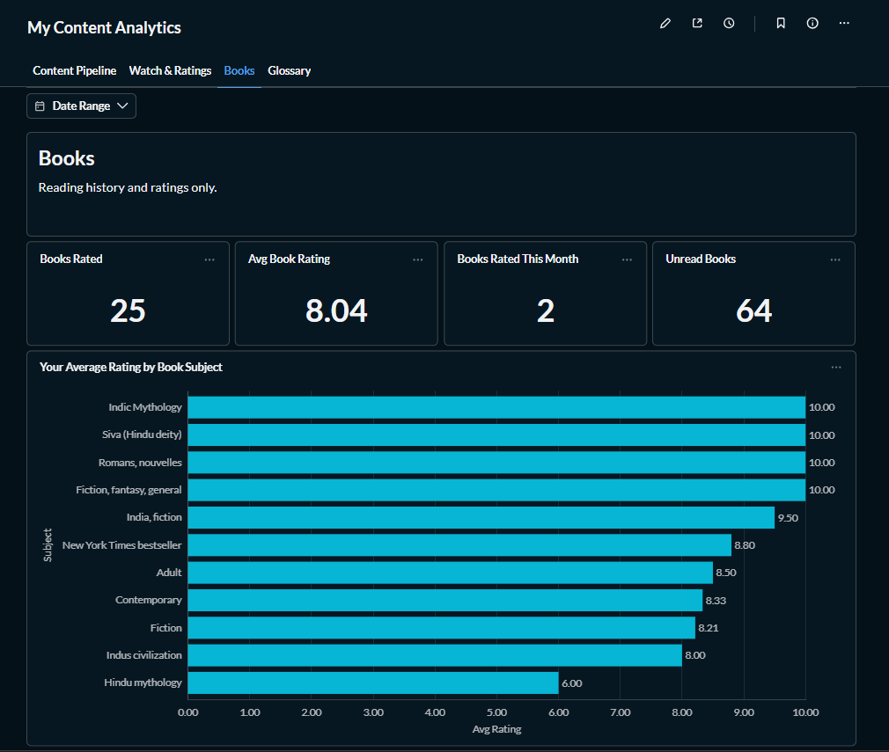
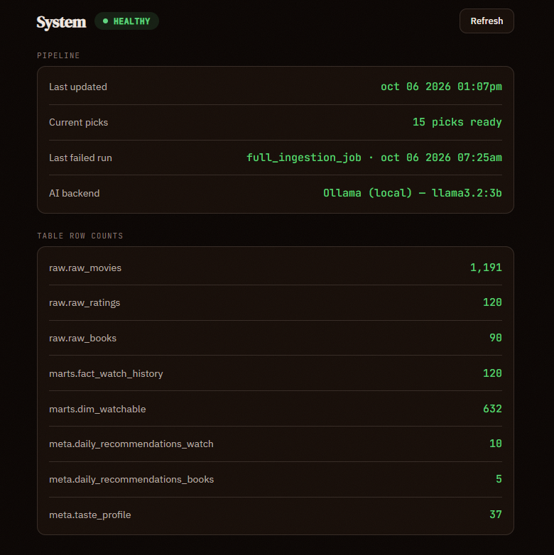

# Personal Content Intelligence Pipeline

A self-hosted data platform that turns personal movie, TV, and book history into weekly recommendations and a plain-English Q&A assistant. It uses no paid APIs and no cloud LLM; everything runs locally.


[](https://github.com/surbhi-bhor/content-intelligence/actions/workflows/ci.yml)



## Contents

- [What it does](#what-it-does)
- [Architecture](#architecture)
- [Tech stack](#tech-stack)
- [How the AI features work](#how-the-ai-features-work)
- [Data quality and reliability](#data-quality-and-reliability)
- [Dashboards (Metabase)](#dashboards-metabase)
- [Quick start](#quick-start)
- [Configuration](#configuration)
- [Operations](#operations)
- [Project structure](#project-structure)
- [Limitations](#limitations)
- [Further reading](#further-reading)
- [Data sources and attribution](#data-sources-and-attribution)
- [License](#license)

## What it does

Streaming and tracking apps each see only their own slice of a person's history, so their recommendations and stats stay siloed. This project brings that history together:

- **Sources:** watch history and ratings from Simkl, reading history from Hardcover, and catalogue data from TMDB and OpenLibrary.
- **One taste profile** across movies, TV, and books.

It serves three things:

1. **Picks:** 10 movie and TV picks plus 5 book picks, refreshed every Friday. Picks are balanced across languages and content types rather than following global popularity.
2. **Ask:** a question box for plain-English questions such as "highest-rated genre?" or "Hindi movies not seen yet?". It runs real SQL against the warehouse and answers only from the rows returned.
3. **Dashboards:** a Metabase dashboard over the same warehouse, plus a status page in the app.

## Architecture

```text
SOURCES → INGESTION (Dagster) → TRANSFORM (dbt) → META (Dagster)
   → AI LAYER (Ollama) → SERVING (Flask / Metabase)
   orchestrated end to end by Dagster on a schedule
```

- **Ingestion:** Dagster ops load four APIs into Postgres `raw` tables.
- **Transform:** dbt builds typed `staging` views, then a dimensional `marts` schema of dimensions, bridge tables, and facts.
- **Meta:** Dagster ops compute the taste profile and weekly picks into the `meta` schema.
- **Serving:** Flask and Metabase read from `marts` and `meta`.

The full diagram, service list, and run order are in [`docs/architecture.md`](docs/architecture.md).

## Tech stack

| Layer | Tool | Why it was chosen |
| --- | --- | --- |
| Ingestion | Python, Dagster ops, Pydantic | Each record is validated before it reaches the database, and each source is its own retriable, observable step |
| Transform | dbt (dbt-core, dbt-postgres) | SQL-based, testable, version-controlled transformations that keep source data separate from computed data |
| Orchestration | Dagster (webserver, daemon, code server) | Real data dependencies between steps, plus schedules, sensors, run history, and logs in one place |
| AI | Ollama (`llama3.2:1b`, `llama3.2:3b`), LangChain | Free local inference with no internet dependency |
| Serving | Flask, Metabase | Flask is a small app with six routes; Metabase covers ad-hoc analysis |
| Infrastructure | Docker Compose, Postgres 15 | Eight services in one file, with every image and package version pinned so the setup reproduces anywhere |

## How the AI features work

Both features follow the same principle: a small local model is useful, but not reliable enough to trust unchecked, so its output is always verified before it is used.

**Picks**

- Candidates are scored in Python from the personal rating history (average rating of matching genres and creators). No LLM generates them.
- Candidates must be unwatched, not dismissed, rated well enough on TMDB, and available on a streaming service in the configured region.
- Daily soaps, TV serials, and reality or talk formats are excluded. They are flagged once, in `dim_watchable.is_serial_format`, using episodes per season and vote count.
- `llama3.2:1b` only chooses and orders 10 picks from a shortlist of top-scored candidates. Every id it returns is checked against that shortlist.
- If the model fails, a deterministic fallback picks instead.
- A final rules pass enforces the language mix and a minimum share of movies, which the small model does not do reliably on its own.

**Ask**

- Questions with no recognisable content keyword are rejected before any SQL is generated.
- `llama3.2:3b` writes SQL for the question.
- Code then repairs known model mistakes, such as missing joins, dropped filters, or a missing minimum-count rule when ranking by average.
- The query runs on a read-only database role with a 5-second timeout, with up to two attempts.
- The answer is written only from the rows returned, never from the model's general knowledge.



## Data quality and reliability

- **Validation:** every API record is parsed into a Pydantic model before insert. Bad records are logged and skipped.
- **Idempotent loads:** raw writes are upserts (`INSERT ... ON CONFLICT`), and every raw row records the Dagster run that wrote it (`pipeline_run_id`).
- **Safe deletes:** if Simkl returns an empty or partly invalid response, deletion of missing titles is skipped, so history cannot be wiped by a bad response.
- **Row-count checks:** an ingestion step fails when a source returns no rows, and warns when it returns fewer than expected.
- **67 dbt tests:** unique keys, non-null columns, allowed values, foreign keys, composite keys, and rating ranges. A failing test stops the run before the taste profile and picks are rebuilt.
- **Freshness checks:** dbt warns when raw data is more than 8 days old and errors after 15 days.
- **Failure alerts:** every failed run is recorded in `meta.pipeline_alerts` and triggers an email. The `/health` page turns red until a later run succeeds.
- **Backups:** a backup container runs `pg_dump` daily and keeps the last 14 copies.
- **Unit tests and CI:** 31 pytest tests cover the core logic (pick validation, language allocation, the SQL safety checks and repairs, the delete guard, TMDB error handling). GitHub Actions runs lint, the tests, and a dbt parse on every push.

## Dashboards (Metabase)

Metabase runs at `localhost:4000` and reads the same Postgres warehouse. The main dashboard, **My Content Analytics**, has two filters (Content Type and Date Range) and four tabs:

| Tab | What it shows |
| --- | --- |
| Content Pipeline | Catalogue size, unwatched candidates (movies and TV), last pipeline run, raw rows ingested |
| Watch & Ratings | Titles rated, average rating, titles rated this month, most-watched genre, average rating by genre, titles watched per month, top platforms |
| Books | Books rated, average book rating, books rated this month, unread book candidates, average rating by book subject |
| Glossary | Definitions of the terms used on the other tabs |





- All questions are native SQL against `marts` and `meta`, so they stay in sync with the dbt models.
- Metabase stores its own settings, questions, and dashboards in an internal database on the `metabase_data` volume, which survives container rebuilds.
- On a fresh install, Metabase asks for an admin account and a database connection on the first visit (host `postgres`, port `5432`, database set to the `POSTGRES_DB` value). Dashboards are not part of the repository, so they need to be recreated there.

## Quick start

**Prerequisites:** Docker Desktop and about 4 GB of free RAM for the two Ollama models, plus headroom for Postgres and Metabase.

```bash
git clone https://github.com/surbhi-bhor/content-intelligence.git
cd content-intelligence
cp .env.example .env        # fill in the values listed under Configuration
docker compose up -d --build
docker compose exec dagster-code python init_db.py      # schemas, tables, read-only role, default settings
docker compose exec -w /opt/dbt dagster-code dbt deps   # installs dbt_utils
docker compose exec ollama ollama pull llama3.2:1b      # picks model
docker compose exec ollama ollama pull llama3.2:3b      # /ask model
```

Next, open the Dagster UI and launch `full_ingestion_job` once to load the initial data. After that, the weekly schedule takes over.

| Service | URL |
| --- | --- |
| Picks app and `/ask` | `localhost:5000` |
| Dagster UI | `localhost:3000` |
| Metabase | `localhost:4000` |

## Configuration

### Environment variables

Set these in `.env`; `.env.example` lists every variable.

| Variable | Purpose |
| --- | --- |
| `POSTGRES_USER`, `POSTGRES_PASSWORD`, `POSTGRES_DB` | Local Postgres credentials. Any values work. |
| `TMDB_API_KEY` | Free key from themoviedb.org, for movie and TV data |
| `SIMKL_CLIENT_ID`, `SIMKL_CLIENT_SECRET`, `SIMKL_ACCESS_TOKEN` | Free app at simkl.com, for watch history and ratings. The secret is only needed once, to get the access token. |
| `HARDCOVER_API_TOKEN` | Free key from hardcover.app, for reading history and ratings |
| `ASK_READONLY_PASSWORD` | Password for the read-only database role used by `/ask`. Any value works. |
| `ASK_DATABASE_URL` | Connection string for that role. Replace `your_ask_readonly_password` in it with the value above. |
| `OLLAMA_BASE_URL`, `OLLAMA_PICKS_MODEL`, `OLLAMA_ASK_MODEL` | The defaults work with Docker Compose. |
| `ALERT_EMAIL_TO`, `SMTP_*` (optional) | Email for failed-run alerts. Gmail needs an App Password. Leave blank to turn email off. |

### Recommendation settings

These are stored in the `meta.user_config` table. `init_db.py` seeds the defaults, and they can be changed with plain SQL.

| Key | Default | Purpose |
| --- | --- | --- |
| `preferred_languages` | `["en", "hi", "mr"]` | Languages fetched from TMDB and eligible for picks |
| `recommendation_language_slots` | `{"en": 4, "hi": 4, "mr": 2}` | How many of the 10 picks each language gets |
| `recommendation_fallback_language` | `"hi"` | Language used when another language runs out of candidates |
| `watch_region` | `"IN"` | Country code used for streaming availability |
| `excluded_genres` | not set | Optional list of genres to never recommend, for example `["Animation"]` |

Example of changing the region:

```sql
UPDATE meta.user_config SET config_value = '"US"' WHERE config_key = 'watch_region';
```

Title details are re-fetched every 30 days, so a region change reaches existing titles within a month and new titles immediately.

## Operations

- **Schedule:** `weekly_pipeline_schedule` runs `full_ingestion_job` every Friday at 12:00 IST. It is switched on by default. A weekly run is enough because viewing and reading history changes slowly.
- **Health page:** `localhost:5000/health` shows the last run, current pick count, last failed run, and row counts for key tables.

  
- **Backups:** daily dumps are saved in `./backups/postgres`. To restore one:

  ```bash
  docker compose exec -T postgres sh -c 'pg_restore -U "$POSTGRES_USER" -d "$POSTGRES_DB" --clean --if-exists' < backups/postgres/<file>.dump
  ```

- **Tests:** `docker compose exec -w /opt/dbt dagster-code dbt build` rebuilds every model and runs all dbt tests. Unit tests run with `pytest` (see [`CONTRIBUTING.md`](CONTRIBUTING.md#running-tests)).
- **Local access only:** every service port is bound to `127.0.0.1`, so the app, Dagster, Metabase, Postgres, and Ollama are reachable from this machine but not from other devices on the network.

## Project structure

```text
dagster/            Orchestration: 9 jobs, 14 ops, database setup (init_db.py)
  ops/               tmdb_op, simkl_op, hardcover_op, openlib_op,
                      taste_profile_op, recommendation_op
  sensors.py         Run-failure alert (email + meta.pipeline_alerts)
dbt/
  models/staging/    5 typed views over the raw tables
  models/marts/      10 tables: dimensions, bridges, facts
flask/               Web app: picks page, /ask, /not-interested, /health, /usage
  templates/          base, index (picks + ask bar), health
docs/                Architecture and case study
tests/               Unit tests (pytest)
.github/workflows/   CI: lint, unit tests, dbt parse
docker-compose.yml   All 8 services
backups/             Daily database dumps (created at runtime, not committed)
```

## Limitations

- **Built for one person on one machine:** services are reachable only from this machine. Flask and Dagster have no login of their own, so the setup is not meant for shared or hosted use. Metabase has its own login.
- **Backups stay on the same machine:** daily dumps protect against a damaged database, not against losing the machine. The history can be re-pulled from Simkl and Hardcover if needed.
- **AI quality is checked by hand:** unit tests cover the logic around the models, but there is no evaluation set that scores `/ask` answers or recommendation quality.
- **Slow `/ask` on a laptop:** answers take from about 40 seconds to a few minutes, because the models run on the CPU. This is the trade-off for running everything locally and for free.
- **Thin regional catalogue:** each run discovers about 20 new titles per language from TMDB, so Hindi and Marathi candidates can run out after several dismissals, and replacements then fall back to English.
- **Book subjects are raw Open Library tags:** they include list labels and synonyms (for example "New York Times bestseller" next to several spellings of Indian mythology), so book answers and picks are less precise than movie and TV genres.

## Further reading

- [`docs/architecture.md`](docs/architecture.md): diagram, services, run order, and where data is stored.
- [`docs/case-study.md`](docs/case-study.md): motivation, design choices, problems solved, and lessons learned.
- [`CONTRIBUTING.md`](CONTRIBUTING.md): adding a data source or dbt model, running tests, and viewing dbt docs.

## Data sources and attribution

This product uses the TMDB API but is not endorsed or certified by TMDB.

| Source | Used for |
| --- | --- |
| [TMDB](https://www.themoviedb.org/) | Movie and TV catalogue, genres, posters, and streaming availability |
| [Simkl](https://simkl.com/) | Personal watch history and ratings |
| [Hardcover](https://hardcover.app/) | Personal reading history and ratings |
| [Open Library](https://openlibrary.org/) | Book metadata, subjects, covers, and book discovery |

Data from these services remains subject to each provider's own terms. The MIT license below covers this project's code only.

## License

Released under the [MIT License](LICENSE).
