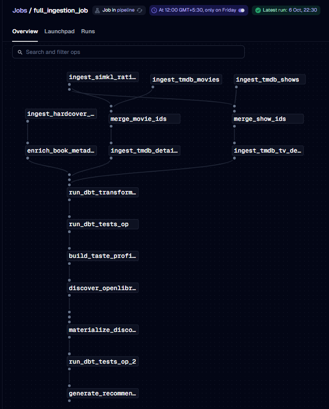
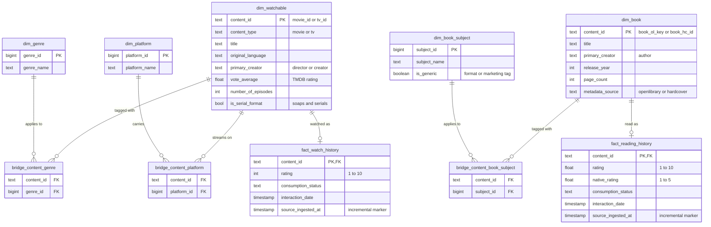
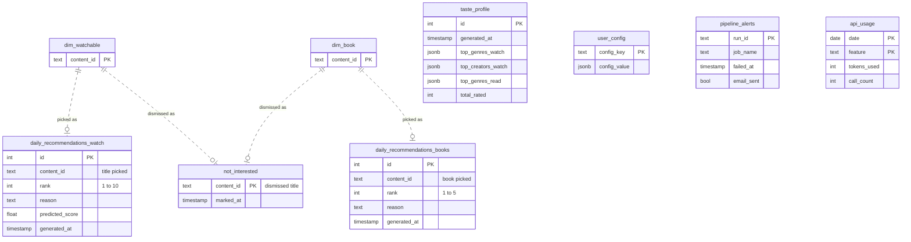

# Architecture

How the pipeline is put together: the components, the order a run follows, and where each kind of data is stored.

## Contents

- [Diagram](#diagram)
- [Services](#services)
- [Weekly run: `full_ingestion_job`](#weekly-run-full_ingestion_job)
- [Schemas](#schemas)
- [Data model](#data-model)
- [Where state lives](#where-state-lives)

## Diagram

```
┌───────────────────────── SOURCES ──────────────────────────┐
│  TMDB API · Simkl API · Hardcover API · OpenLibrary API    │
└──────────────────────────────┬─────────────────────────────┘
                               │
                               ▼
┌───────────────── INGESTION (Dagster ops) ──────────────────┐
│  tmdb_op.py      ──► raw.raw_movies, raw.raw_movie_details │
│                      raw.raw_tv, raw.raw_tv_details        │
│  simkl_op.py     ──► raw.raw_ratings                       │
│  hardcover_op.py ──► raw.raw_book_ratings                  │
│  openlib_op.py   ──► raw.raw_books (enrich + discover)     │
│                                                            │
│  Pydantic validation per record                            │
│  Row-count guards: raise on 0 rows, warn below minimum     │
└──────────────────────────────┬─────────────────────────────┘
                               │  dbt run, then dbt test
                               ▼
┌───────────────────── TRANSFORM (dbt) ──────────────────────┐
│  staging (5 views)                                         │
│    stg_movies · stg_tv · stg_ratings                       │
│    stg_books · stg_book_ratings                            │
│          │                                                 │
│          ▼                                                 │
│  marts (11 tables, indexed)                                │
│    dim_watchable ◄── movies + TV, conformed                │
│    dim_book ◄── Hardcover + OpenLibrary, conformed         │
│    dim_genre · dim_platform · dim_book_subject             │
│    bridge_content_genre · bridge_content_platform          │
│    bridge_content_book_subject                             │
│    fact_watch_history · fact_reading_history               │
│      (incremental on the source ingested_at)               │
│    book_candidate_scores ◄── unread books vs. reads        │
│                                                            │
│  79 schema tests gate everything downstream                │
│  Source freshness: warn 8 days, error 15 days              │
└──────────────────────────────┬─────────────────────────────┘
                               │
                               ▼
┌──────────────────── META (Dagster ops) ────────────────────┐
│  taste_profile_op.py                                       │
│    ──► meta.taste_profile                                  │
│        (genre/creator avg + count, watch vs. read)         │
│                                                            │
│  recommendation_op.py                                      │
│    ──► meta.daily_recommendations_watch  (10 picks)        │
│    ──► meta.daily_recommendations_books  (5 picks)         │
│        (scored candidates + language/type balancing)       │
└──────────────────────────────┬─────────────────────────────┘
                               │
                               ▼
┌───────────────── AI LAYER (local Ollama) ──────────────────┐
│  llama3.2:1b ──► picks selection                           │
│    constrained: chooses from a pre-scored shortlist,       │
│    every id validated, deterministic fallback              │
│                                                            │
│  llama3.2:3b ──► /ask text-to-SQL                          │
│    runs each candidate query on a read-only role,          │
│    answers only from the rows it returns                   │
└──────────────────────────────┬─────────────────────────────┘
                               │
                               ▼
┌───────────────────────── SERVING ──────────────────────────┐
│  Flask :5000                                               │
│    /  picks page + ask bar    /tonight ──► /               │
│    /ask · /not-interested · /health · /usage               │
│  Metabase :4000 ──► BI dashboards over content_db          │
│    (app DB persisted on the metabase_data volume)          │
└────────────────────────────────────────────────────────────┘

┌────────────────────── ORCHESTRATION ───────────────────────┐
│  Dagster :3000 (webserver) + dagster-daemon                │
│  9 jobs, incl. full_ingestion_job (the whole chain above)  │
│  weekly_pipeline_schedule: Fri 12:00 IST (0 12 * * 5),     │
│    ships RUNNING                                           │
│  pipeline_failure_alert sensor ──► email alert +           │
│    meta.pipeline_alerts (/health goes red)                 │
└────────────────────────────────────────────────────────────┘

Postgres 15 (content_db) holds all pipeline data shown above.
Dagster keeps its run history in SQLite; Metabase keeps its own data in H2.
The postgres-backup container dumps content_db daily (last 14 kept).
```

## Services

All eight services are defined in one `docker-compose.yml`. Every published port is bound to `127.0.0.1`, so they are reachable from this machine only.

| Service | Port | Role |
| --- | --- | --- |
| `postgres` | 5432 | Postgres 15, database `content_db`: `raw`, `staging`, `marts`, and `meta` schemas |
| `dagster-code` | internal only | Holds the jobs, ops, schedule, and sensor, and runs dbt |
| `dagster` | 3000 | Dagster webserver (UI, run launching, run history) |
| `dagster-daemon` | none | Fires the weekly schedule and the run-failure sensor |
| `ollama` | 11434 | Local LLM inference. Both models stay loaded in memory to avoid slow reloads. |
| `flask` | 5000 | Picks page, `/ask`, `/not-interested`, `/health`, `/usage` |
| `metabase` | 4000 | Dashboards over `content_db` (see the README's Dashboards section) |
| `postgres-backup` | none | Daily `pg_dump` of `content_db` to `./backups/postgres`, last 14 kept |

## Weekly run: `full_ingestion_job`

Steps run in dependency order, and independent branches run in parallel.



1. **Ingest:** `ingest_tmdb_movies`, `ingest_tmdb_shows`, `ingest_simkl_ratings`, and `ingest_hardcover_books` run in parallel.
2. **Merge ids:** TMDB discovery ids and Simkl watched ids are merged per content type (`merge_movie_ids`, `merge_show_ids`).
3. **Enrich:** `ingest_tmdb_details` and `ingest_tmdb_tv_details` fetch details and streaming platforms for new titles and for titles older than 30 days; `enrich_book_metadata` matches library books to OpenLibrary (by title, then by title and author).
4. **Transform and test:** `run_dbt_transformations` (`dbt run`), then `run_dbt_tests_op` (`dbt test`). A test failure fails the run here.
5. **Taste profile:** `build_taste_profile` appends a new row to `meta.taste_profile`.
6. **Book discovery:** `discover_openlibrary_books` searches OpenLibrary by the specific subjects and authors of books rated 4 stars or more, followed by a second `dbt run` and `dbt test` so new books are scored in `book_candidate_scores`.
7. **Recommendations:** `generate_recommendations` replaces `meta.daily_recommendations_books` (5 picks) first, then `meta.daily_recommendations_watch` (10 picks).

Every op that calls an outside API (steps 1, 3 and 6) retries twice, after 1 and then 2 minutes, before failing the run.

The other eight jobs run parts of this chain on demand, for example `simkl_ingestion_job` or `recommendation_job`.

## Schemas

All pipeline data lives in one Postgres database, `content_db`, split into four schemas. Each schema has one owner.

| Schema | What it holds | Owner | Rebuilt each run? |
| --- | --- | --- | --- |
| `raw` | Source data exactly as each API sent it (7 tables) | Ingestion ops | No, rows are upserted |
| `staging` | Cleaned, typed, deduplicated views (5 views) | dbt | Yes (views) |
| `marts` | Dimensions, bridge tables, facts, and book candidate scores (11 tables) | dbt | Yes, except the two fact tables, which update incrementally |
| `meta` | App state and settings (7 tables) | Dagster ops, Flask, and the user | No, created once by `init_db.py` |

**Why `meta` is separate from `marts`**

- dbt rebuilds `marts` from `raw` on every run, so anything stored there would be overwritten.
- `meta` holds data that cannot be rebuilt from `raw`:
  - **Computed results:** taste profile history, current picks, failed-run alerts, `/ask` usage.
  - **User input:** recommendation settings (`user_config`) and dismissed titles (`not_interested`).
- Keeping one owner per schema avoids conflicts. dbt never touches `meta`, and the ops never write to `marts`.

## Data model

The analytical layer (`marts`) is a star schema built by dbt. The app layer (`meta`) stores what the pipeline computes and what the user sets. Solid lines are relationships enforced by dbt tests; dashed lines are references by `content_id` that are not enforced.

### Marts (dbt)



- **`dim_watchable`** combines movies and TV in one dimension, so a query never needs to know which source a title came from.
- **Bridge tables** link titles to genres, platforms, and book subjects, because each title can have many of each.
- **Two fact tables** hold the personal history: one row per watched title and one row per book. They are separate because watching and reading come from different sources and carry different details.
- **Both fact tables update incrementally**, processing only rows whose source changed (`source_ingested_at`).

### Meta (app state)



- **Picks** (`daily_recommendations_watch` and `daily_recommendations_books`) are replaced on every run.
- **`taste_profile`** gains a new row on every run, so its history is kept.
- **`not_interested`** and **`user_config`** hold user input. That is why they live in `meta`: dbt rebuilds `marts` each run and would overwrite them.
- **References to `marts` are not foreign keys.** The marts tables are dropped and rebuilt by dbt, so a database-level constraint would block every rebuild.

## Where state lives

| State | Location | Written by |
| --- | --- | --- |
| Source data as received | `raw.*` tables | Ingestion ops (upserts stamped with `pipeline_run_id`) |
| Cleaned, typed data | `staging.*` views | dbt |
| Dimensions, bridges, facts | `marts.*` tables | dbt (facts are incremental) |
| Taste profile, picks, dismissals, settings, alerts | `meta.*` tables | Dagster ops, Flask (`not_interested`), and the failure sensor |
| Dagster run history and schedule state | SQLite on the `dagster_home` volume | Dagster |
| Metabase questions and dashboards | H2 on the `metabase_data` volume | Metabase |
| Model weights | `ollama_data` volume | Ollama |
| Backups | `./backups/postgres` on the host | `postgres-backup` |
